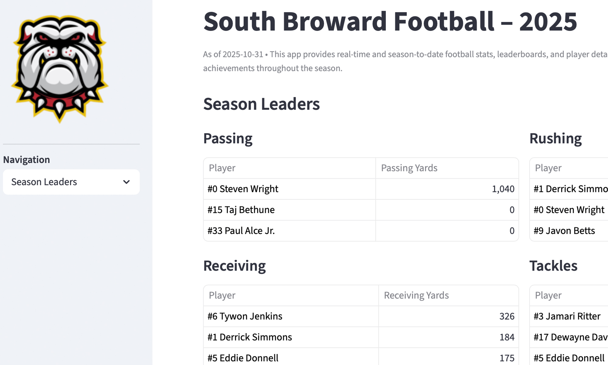
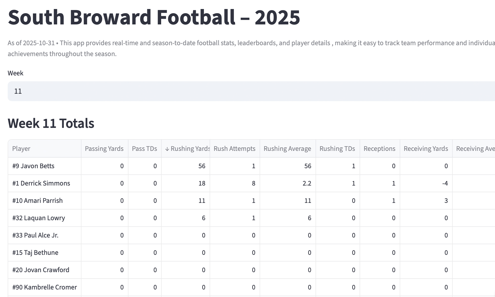
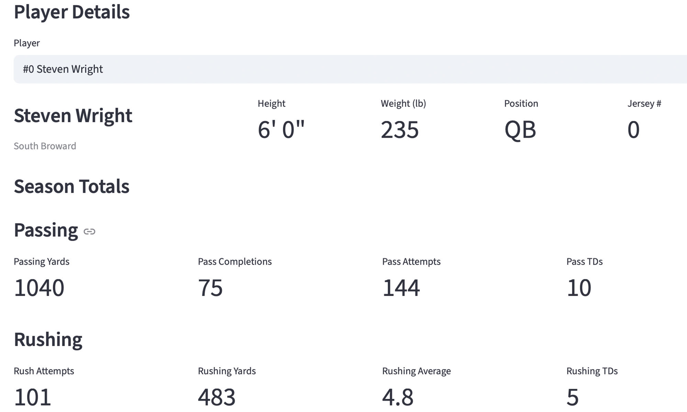

# South Broward Football Stats Dashboard

A Streamlit dashboard that displays season and weekly football statistics for the South Broward High School football program. Built to give players a way to track their own performance and to support MaxPreps submissions for recruiting visibility.

**Live App:** [sideline-sbhs.streamlit.app](https://sideline-sbhs.streamlit.app)

**Backend Repo:** [sideline-back-end](https://github.com/lamechbob/sideline-back-end)

**Full Project Write-Up:** [lamech.dev/projects/south-broward-football-stats](https://lamech.dev/projects/south-broward-football-stats)

---

## Features

**Season Leaders** - Home page showing top performers across passing, rushing, receiving, and tackles.

**Weekly Totals** - Week-by-week stat breakdown with sortable columns, allowing users to filter leaders by any statistic.

**Player Detail** - Individual player view showing height, weight, position, jersey number, and a full statistical profile across the season including passing, rushing, receiving, tackles, sacks, and special teams.

---

## Screenshots

### Home Page

Season leaderboard at a glance. Navigation links to weekly totals and individual player views.

### Weekly Totals

Week-by-week stat breakdown with sortable columns.

### Player Detail

Individual player view showing a full statistical profile across the season.

---

## How It Works

The dashboard reads from `season_summary.csv`, which is generated by a SQL aggregation view on the backend and exported to S3. The CSV contains per player stats rolled up by week and cumulative season totals.

The dashboard does not connect directly to the database. This was an intentional design decision — a public facing app has no business connecting to an RDS instance sitting in a private subnet.

---

## Tech Stack

- **Streamlit** - Dashboard UI
- **Python** - Data processing and display logic
- **Pandas** - Data manipulation
- **Amazon S3** - Source for `season_summary.csv`

---

## Related

- [Backend & Lambda Functions](https://github.com/lamechbob/sideline-back-end) - ETL pipeline, database schema, import modules
- [Full Project Write-Up](https://lamech.dev/projects/south-broward-football-stats) - Architecture, engineering decisions, and post-season analysis
